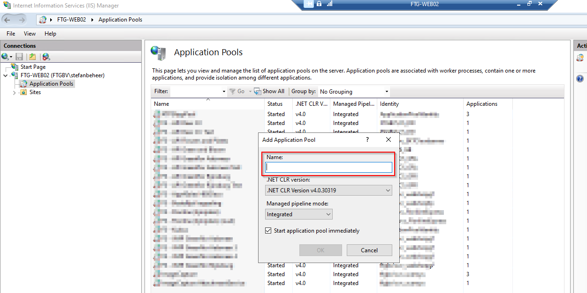
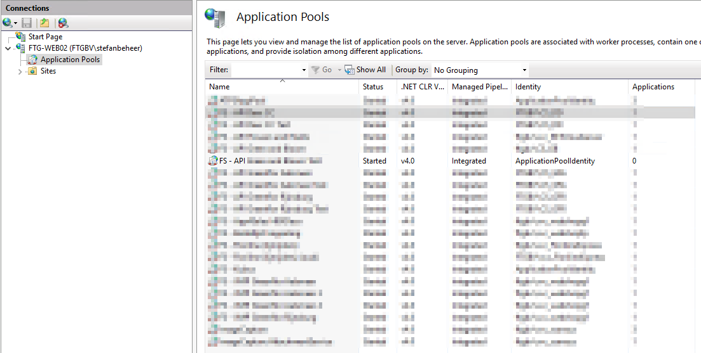
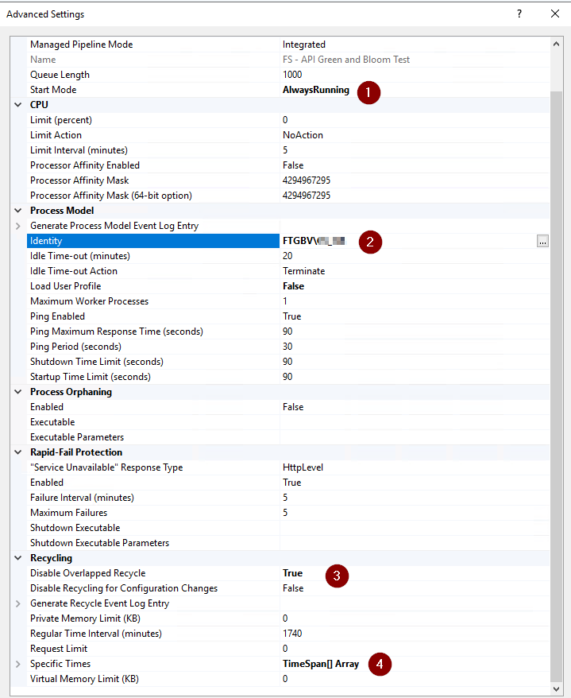
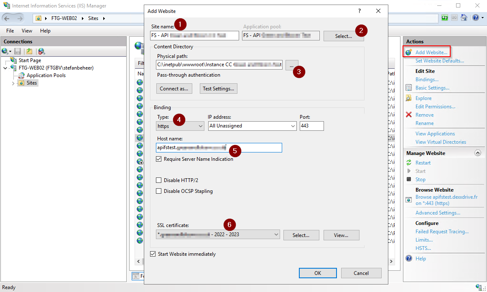
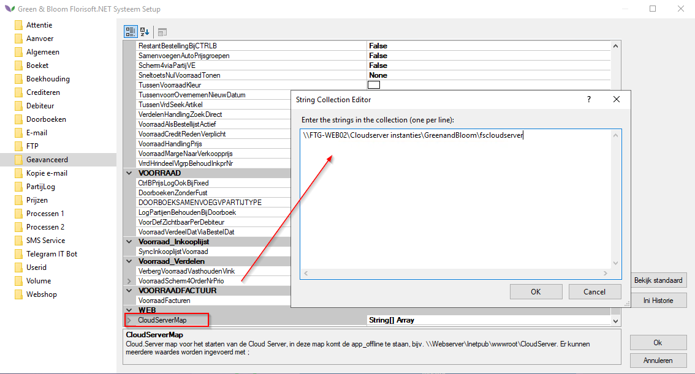
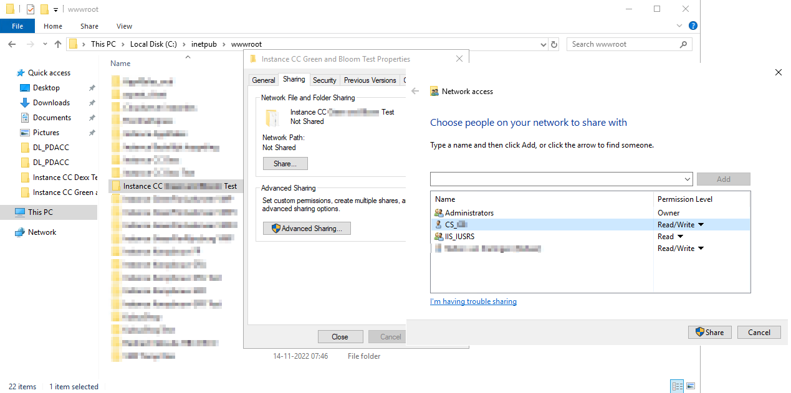

# CloudServer inrichten

Dit document beschrijft het inrichten/instellen van de API/CloudServer t.b.v. cloud applicaties

## Inhoudsopgave

[Downloaden van de app](#downloaden-van-de-app)  
[Algemene werking van de app](#algemene-werking-van-de-app)  
[Afrekenen met C&C Touch](#afrekenen-met-cc-touch)  

## Downloaden van de app

Eerst moet u de Cash & Carry app geïnstalleerd hebben u kan deze downloaden op de onderstaande link: 

https://app.florisoft.nl/cc/fase2/cc.apk

Ook kan er gebruik gemaakt worden van de onderstaande QR code:

Na het downloaden installeert u de app.

## Algemene werking van de app

*De onderstaande stappen lopen door de algemene werking van de app heen. Het onderstaande scenario gaat er van uit dat u de app voor de eerste keer opent.*

|Stap|Uitleg|
|:-:|:--|
|**1**|Open Internet Information Services (IIS) en klik op de **Add Application Pool** knop rechts bovenin. Vul de naam in van de cloud applicatie en klik op OK.

<b>Klik voor voorbeeld</b>

|
|**2**|De Application Pool is aangemaakt.

<b>Klik voor voorbeeld</b>

|
|**3**|We gaan nu de **Advanced Settings** van de Application Pool wijzigen. Wijzig **Start Mode** > AlwaysRunning.[1] Wijzig Identity > FTGBV/{USER}[2] Wijzig Disable Overlapped Recycle > True.[3] Wijzig Specific Times > Value 02:00:00.[4] 

<b>Klik voor voorbeeld</b>

|
|**4**|We gaan nu de website aanmaken. Geef de website een naam.[1] Selecteer de Application Pool die we in vorige stap 2 hebben aangemaakt.[2] Geef het pas aan waar de instantie staat[3] Binding instellen op https.[4] Host name invullen met de gewenste 'vriendelijke' URL en het vinkje aanzetten.[5] Koppel vervolgens een certificaat.[6] 

<b>Klik hier voor voorbeeld</b>

|
|**5**|Zorg ervoor dat de CloudServerMap bekend is in Florisoft. Deze kan je toevoegen via de systeeminstellingen.

<b>Klik hier voor voorbeeld</b>

|
|**6**|De Instance directory moet ge-shared worden zodat de map te benaderen is vanaf de server waarop Florisoft actief is. Geef de gebruiker je gekoppeld heb bij de Application Pool de Read/Write rechten.

<b>Klik hier voor uw voorbeeld!</b>

|
|**7**|Maak nu een nieuwe bestelling/order aan (met de Create order knop) of selecteer een bestaande uit de lijst. Bij het aanmaken van een nieuwe order kan u een eigen ordernaam of datum invullen of dit laten bepalden door de app.

<b>Klik hier voor uw voorbeeld!</b>

|
|**8**|U ziet nu het orderscherm van de Cash & Carry app, om partijen toe te voegen kan u een barcode scannen of opzoeken door op het vergrootglas te klikken. 

<b>Klik hier voor uw voorbeeld!</b>

|
|**9**|Na het inscannen van een barcode of het zoeken & toevoegen van een voorraad partij ziet u dat het orderscherm geüpdatet is met de zojuist toegevoegde partij. Dit ziet u ook terug in de totaalprijs van de bestelling.

<b>Klik hier voor uw voorbeeld!</b>

|
|**10**|U kan uiteraard nog meer partijen toevoegen, scan of zoek deze op om het toe te voegen aan de bestelling.|
|**11**|*Wilt u een bestelling annuleren?* Klik dan op het hamburger menu'tje rechtsbovenin het scherm. Klik dan vervolgens op **cancel order**

<b>Klik hier voor uw voorbeeld!</b>
   
|
|**12**|*Wilt u een bestelling overzetten naar een andere debiteur?* Klik dan op het hamburger menu'tje rechtsbovenin. Klik dan vervolgens op **Move order**. 

<b>Klik hier voor uw voorbeeld!</b>
   
|
|**13**|*Wilt u naar een volgende klant/bestelling met een andere bestelling?* Klik dan op **Next Customer.**

<b>Klik hier voor uw voorbeeld!</b>
   
|
|**14**|Om Fust toe te voegen aan een bestelling klik u op de knop **+ Pack**

<b>Klik hier voor uw voorbeeld!</b>

|
|**15**|U bevind zich nu op het Fustscherm van de Cash & Carry app, u ziet hier een overzicht van eventueel bestaand Fust in de bestelling. Deliver is het aantal Fust items in de bestelling en return het terug gebrachtte Fust items.

<b>Klik hier voor uw voorbeeld!</b>

|
|**16**|Voor het toevoegen van Fust klikt u op de knop **+ Package**, u krijg nu een invoerscherm te zien waarin u kan zoeken naar een Fust om vervolgens in te vullen of dit meegenomen of terug gebracht wordt.

<b>Klik hier voor uw voorbeeld!</b>

|
|**17**|Daarnaast kan u ook op een fust regel waarde (Deliver of Return) drukken om het te selecteren. Vervolgens klikt u op de **+** of **-** knop om het ophogen of verlagen. 

<b>Klik hier voor uw voorbeeld!</b>

|
|**18**|Bent u klaar met Fust en partijen toevoegen? Ga dan terug naar de winkelwagen en druk op de Pay knop. |
|**19**|U krijgt nu een samenvatting te zien van uw winkelagen, u hoort hier uw partijen en fust te zien staan met een te betalen bedrag. 

<b>Klik hier voor uw voorbeeld!</b>

|
|**20**||
|**21**||
|**22**||
|**23**||
|**24**||
|**25**||

<!--
    De laatste stappen moeten het betaalproces bevatten, hier staat voor nu nog 'Next customer'. Ik was hier mee bezig maar de Cloud server doet zo kut! Probeer zo min mogelijk uit en in te loggen dat vindt ie niet leuk.

    Vraag Hans of in het 'CC' Slack kanaal wat hier de bedoeling is.
-->

## Afrekenen met C&C Touch

*Ook is het mogelijk om Cash & Carry af te laten rekenen bij een afreken station van C&C Touch. Door de onderstaande stappen leest u dit doet:*

<!-- 
 Ik denk niet dat dit door de klant in te stellen is?
 Vraag dit aan @JelleBol?
 Juliën (04/04)
-->
