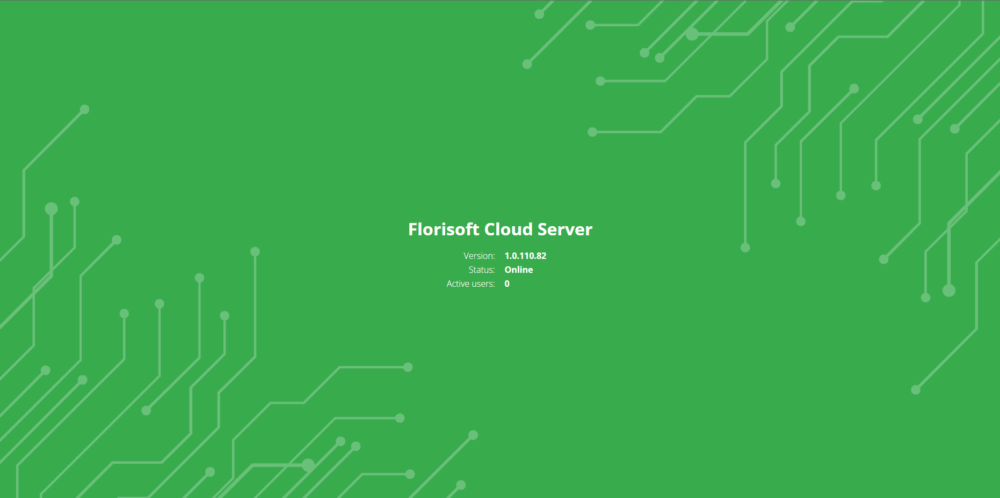

# CloudServer inrichten

Dit document beschrijft het inrichten/instellen van de API/CloudServer t.b.v. cloud applicaties

## Inhoudsopgave

[Inrichten CloudServer](#inrichten-cloudserver)  

## Inrichten CloudServer

|Stap|Uitleg|
|:-:|:--|
|**1**|Open Internet Information Services (IIS) en klik op de **Add Application Pool** knop rechts bovenin. Vul de naam in van de cloud applicatie en klik op OK.

<b>Klik voor voorbeeld</b>

|
|**2**|De Application Pool is aangemaakt.

<b>Klik voor voorbeeld</b>

|
|**3**|We gaan nu de **Advanced Settings** van de Application Pool wijzigen. Wijzig Start Mode > AlwaysRunning.[1] Wijzig Identity > FTGBV/{USER}[2] Wijzig Disable Overlapped Recycle > True.[3] Wijzig Specific Times > Value 02:00:00.[4] 

<b>Klik voor voorbeeld</b>

|
|**4**|We gaan nu de website aanmaken. Geef de website een naam.[1] Selecteer de Application Pool die we in STAP 2 hebben aangemaakt.[2] Geef het pad aan waar de instantie staat. (Je kan een instantie kopieren, pas de FS-INTRO.dbf aan)[3] Binding instellen op https.[4] Host name invullen met de gewenste 'vriendelijke' URL. Een binding kan je aanvragen bij Arjan van Rijn.[5] Koppel vervolgens een certificaat.[6] 

<b>Klik hier voor voorbeeld</b>

|
|**5**|Zorg ervoor dat de CloudServerMap bekend is in Florisoft. Deze kan je toevoegen via de systeeminstellingen.

<b>Klik hier voor voorbeeld</b>

|
|**6**|De Instance directory moet ge-shared worden zodat de map te benaderen is vanaf de server waarop Florisoft actief is. Geef de gebruiker je gekoppeld heb bij de Application Pool de Read/Write rechten.

<b>Klik hier voor voorbeeld</b>

|
|**7**|Als je de stappen goed heb doorlopen en je de URL opvraagt via je browser moet je dit scherm krijgen

<b>Klik hier voor voorbeeld</b>

|
