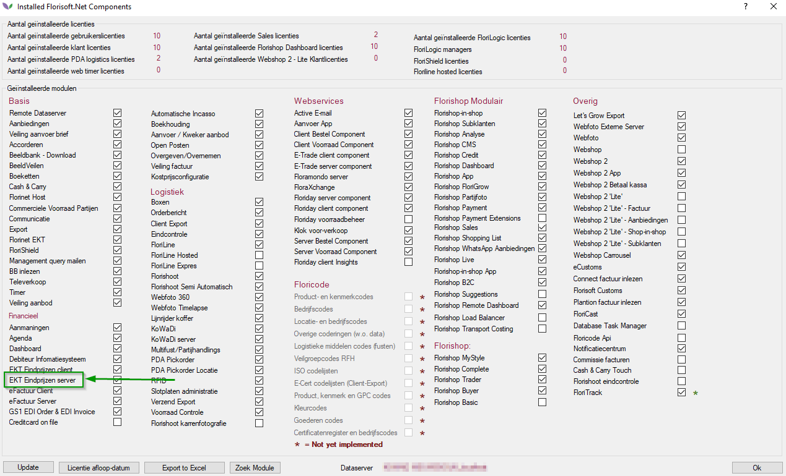
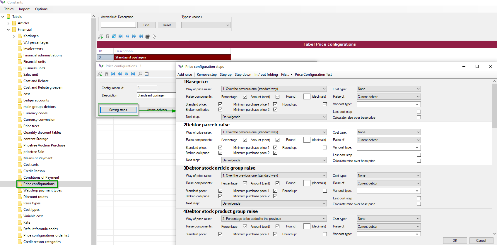
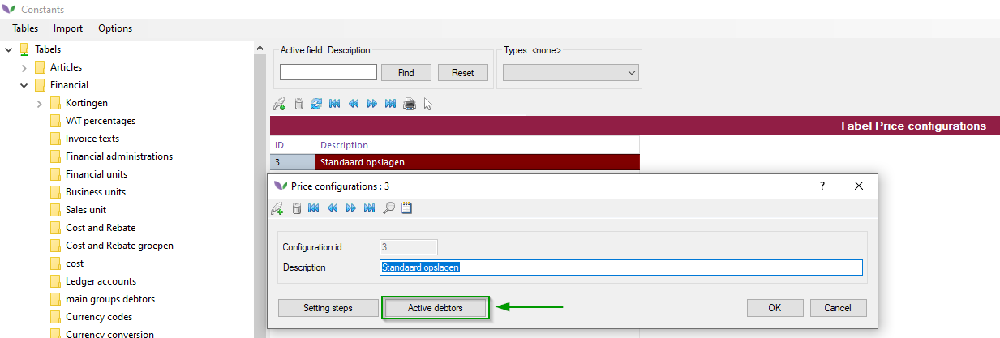
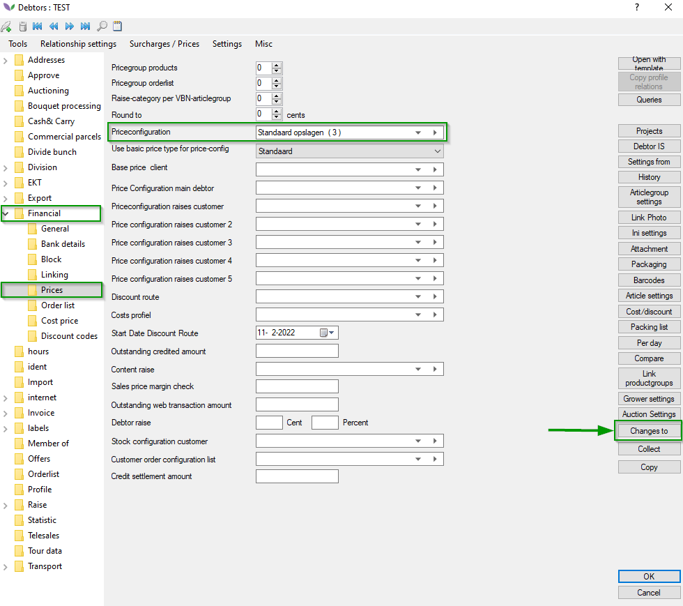
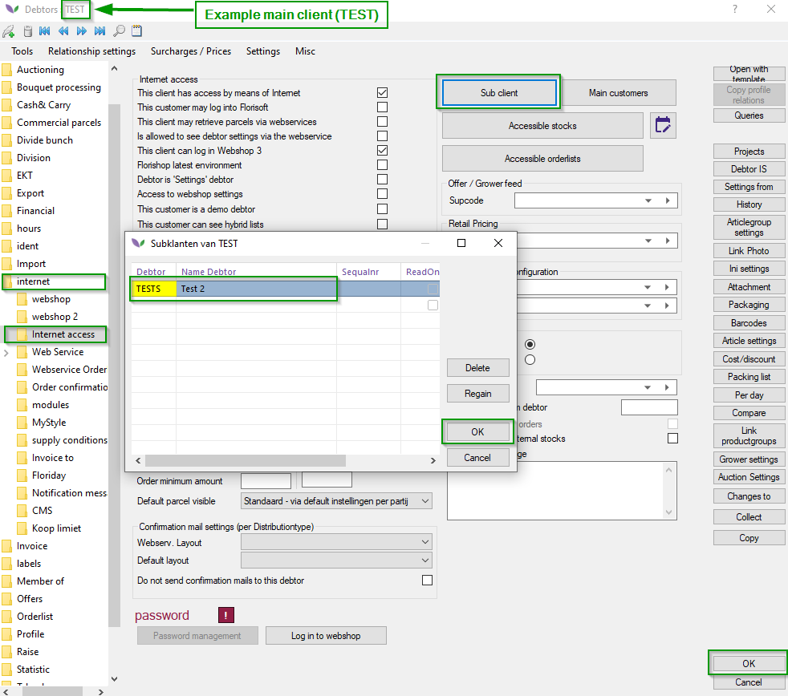
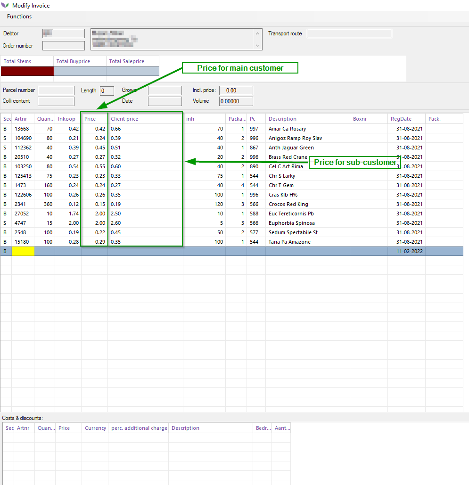
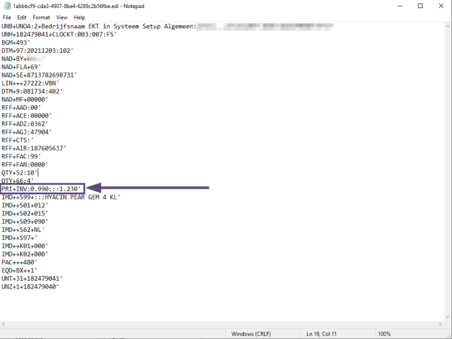

# Documentation EKT final prices client

## 1. Introduction
This manual describes the (technical) operation of the EKT end prices module 9serverside). The focus in this document is mainly on the logic of this module.

Many webshops are used by main customers who use their own automation behind it. Both the main and sub-customer systems must be provided with correct information. especially final price information for the sub-customer. The EKT final prices server module makes this possible.

The advantage here is that the main customer uses the customer's system and there also the product range in this system.

The EKT finap prices server module makes billing for the main customer to the sub-customer easier. It is no longer necessary to manually enter prices for the sub-customer. The prices for the sub-customer are sent directly in the EKT.

With the EKT final prices server module, the EKT sent, contains two prices: one for the main customer and once for the sub-customer. The following segment is used for this: PRI+INV:0.27:::0.36.

In the example above, 0.27 cents is the price for the main customer. The 0.36 cents is the price for the sub-customer. A condition for the correct functioning of the EKT final prices server module is that the main customer's system must be able to read and proces this extra information.

## 2. Activating module
The first step consists of activating the EKT final prices server module:

This module can be added to the customer's license file by means of a license code. The license code becomes available after agreement on the corresponding quotation.

> **Note: Florisoft must be restarted after activating the module.**

## 3. Set up price configuration(s)
Prices are always calculated in Florisoft by means of a price configuration. A price configuration is a collection of settings (steps in ascending order) that builds up a price for the customer (group).

Price configurations can be found in the Constants under the tab Financial -> Price configurations. See the screenshot below for an example:

Correct prices for end customers can be roughly calculated in two ways: by using the same price configuration for both the main and sub-customer, or by choosing a seperate price configuration for the main and sub-customer.

The best working method must be mapped out per customer. In addition, the prices for the main and sub-customers must be set up correctly in Florisoft.

>**Note: do not forget to link the price configuration(s) to the relevant debtors. this can be done in two ways: from the price configuration or from a specific debtor.**
>
>**Price configuration**
>Open the relevant price configuration and click on the Active debtors button
>
>
>
>Then select (click on the Select button) the debtors that should be linked to this price configuration and confirm by pressing the Ok button in all screens.
>
>
>
>**Debtor**
>Open the debtor from Constants -> Community -> Debtor data -> Debtors. Then go to the Financial -> Prices tab and choose the correct > price configuration in the Price configuration field.
>
>Then click on the Ok button to confirm the settings. Optionally, you can also first choose the Change to option to apply the selected price configuration to multiple selected debtors.

## 4. Link sub-customers to main customers
To ensure that the final price for the sub-customers is sent correctly, the sub-customers must first be linked to the main customer. This will go like this:

1. Navigate in the Constants to Community -> Debtor data -> Debtors.
2. Open a main customer by double clicking on the relevant line of this debtor. In the screenshot below, debtor TESt had been chose as an example for a main customer.

3. Navigate in the debtor to the tab Internet -> Internet access.
4. Click the Subcustomers button. The screen Sub-customers of [DEBTOR-NAME] opens.
5. Enter the debtor numbers of the sub-customers belonging to selected main customer in the Debtor column on each line one by one. In this example it is Test (main customer) and there are not sub-customers here.
6. Click the Ok button twitce to confirm the settings.

## 5. Activate debtor setting
To ensure that the calculated price (via the price configuration) for the end customer is sent in the EKT, the Send final price in EKT message must be checked on. See the screenshot below:

>**Note: the Send final price in EKT message must only be activated for the main customers. This check should not be checked on the sub-customers.**

Click the Ok button in the debtor screen to activate the above setting. 

>**Note: restart any webshop(s) to activate the above settings.**

## 6. Divide with final prices sub-customers
Now that all basic settings regarding final prices have been set, distribution cna be made by the main or sub-customer.

Distribution can be done in Florisoft in different ways: from stock, Ctrl+B, Telesales and webshop. Regardles of the distribution type, the prices for both the main and the sub-customer are calculated on the basis of the set price configuration.

See the screenshot below for an example of a main customer invoice line where the final price for the sub-customer is displayed in the Client Price column. The price for the lead customer is vivisble in the Price column.

When sending the relevant invoice lines via EKT, this looks like this:

It can be clearly seen that the PRI+INV segment consists of two segments: the price for the main customer (0.99 in the example above) and 1.23 for the end customer.

As soon as the main customer's system is correctly configured for reading these prices, he can use the above information for the automatic processing of orders including further financial settlement.

The above six steps have broadly described the logic behind the EKT server end prices module. Of course, there are many settings available at a detailed level to achieve specific behaviour, but that is beyond the scope of this documentation.